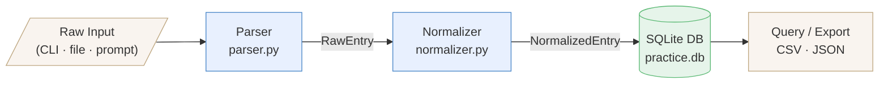

# 🎹 Piano Practice Logger

A lightweight CLI tool for logging, normalizing, and querying piano practice sessions. Raw practice entries flow through a structured **parser → normalizer → database** pipeline, producing clean, queryable records you can use to track progress over time.

---

## Table of Contents

- [Project Overview](#project-overview)
- [Features](#features)
- [Architecture](#architecture)
- [Pipeline Diagram](#pipeline-diagram)
- [Installation](#installation)
- [Usage](#usage)
- [Project Structure](#project-structure)
- [Contributing](#contributing)
- [License](#license)

---

## Project Overview

Piano Practice Logger ingests free-form or structured practice entries — pieces practiced, duration, tempo, notes — and persists them in a local SQLite database. The three-stage pipeline ensures that raw input is validated, consistently formatted, and stored in a schema ready for analysis and visualization.

---

## Features

- **Flexible input parsing** — Accepts practice logs from CLI arguments, plain-text files, or interactive prompts.
- **Data normalization** — Standardizes durations, tempos, piece titles, and tags for consistent querying.
- **SQLite storage** — Zero-config local database with full SQL access for ad-hoc analysis.
- **Session summaries** — Query total practice time by day, week, piece, or custom date range.
- **Export support** — Dump sessions to CSV or JSON for use in notebooks or dashboards.
- **Idempotent imports** — Duplicate entries are detected and skipped automatically.

---

## Architecture

The application is organized around three core processing stages:

| Stage          | Module              | Responsibility                                                  |
|----------------|---------------------|-----------------------------------------------------------------|
| **Parser**     | `parser.py`         | Tokenizes raw input into structured `RawEntry` objects.         |
| **Normalizer** | `normalizer.py`     | Validates, cleans, and transforms entries into `NormalizedEntry` objects. |
| **Database**   | `db.py`             | Maps normalized entries to SQLite rows; handles queries and exports. |

A thin **CLI layer** (`cli.py`) orchestrates the pipeline and exposes user-facing commands.

---

## Pipeline Diagram

## Pipeline Diagram

---
